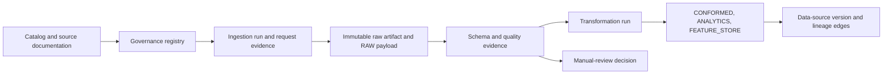

# Snowflake Data Provenance Implementation

## Purpose and scope

This document defines the Snowflake implementation contract for data provenance in the TOPx Lyme Surveillance and Context Explorer. It governs how the platform records where data came from, what it meant when received, how it was retrieved, whether it passed validation, and how it contributed to a curated data product, feature set, or model result.

It is intentionally broader than technical load logging. A reported Lyme count, tick observation, weather value, or contextual measure is only interpretable with its source version, time and geography semantics, methodology, case-definition era, uncertainty, and transformation history. The design supports the public-data MVP first and can be extended into approved controlled-data enclaves without treating restricted data as public or directly linkable.

## Executive summary

Implement a dedicated `PUBLIC_HEALTH_ANALYSIS.GOVERNANCE` schema alongside the existing `RAW`, `STAGING`, `CONFORMED`, `ANALYTICS`, and `FEATURE_STORE` schemas. The governance schema holds an append-only provenance ledger; it does not replace Snowflake's native lineage, access history, tags, or catalog capabilities. Instead, it provides the source-specific evidence those platform features cannot infer: the exact public endpoint and query, immutable source artifact, schema and documentation snapshots, quality verdict, review decision, and semantic caveats.

The implementation has three connected layers:

The five required operational registry tables are `catalog_datasets`, `catalog_resources`, `source_access_profiles`, `ingestion_runs`, and `dataset_quality_assessments`. This design adds the supporting tables needed to make those records reproducible and auditable in practice.

## Business problems solved

| Business problem | Provenance capability | Outcome |
|---|---|---|
| A dashboard or model cannot explain where a number came from. | Immutable artifacts, source versions, transformation runs, and lineage edges. | A user can trace an output to the exact source artifact and retrieval. |
| Publisher schemas, licenses, definitions, and update notes change without warning. | Metadata, documentation, and schema snapshots; change events; review workflow. | Changes are detected and assessed before affected data is promoted. |
| CDC surveillance eras, county-of-residence data, suppression, and contextual environmental data can be wrongly combined. | Dataset-level semantics, limitations, case-definition fields, and quality rules. | Joins and displays retain their public-health meaning and caveats. |
| Pagination, throttling, failed downloads, or reruns create incomplete or irreproducible loads. | Run- and request-level logging, including errors and deterministic page sequence. | A failed or partial source is visible; it is never silently omitted. |
| A raw source is overwritten or later revised. | Content-addressed raw-artifact register and immutable RAW load references. | Earlier analyses can be reconstructed and diffs can be explained. |
| Data-quality alerts confuse genuine epidemiological conditions with ETL defects. | Rule-level results, null/suppression classifications, thresholds, and review decisions. | Suppressed, unknown, not-reported, and missing values remain distinct. |
| Snowflake native lineage cannot show external API calls or a source's methodology. | Custom external-source registry plus native Snowflake lineage and tags. | End-to-end lineage covers both external acquisition and in-warehouse transformations. |
| Restricted sources are introduced later. | Access profiles, classification, approval references, and enclave/location fields. | The platform enforces least privilege and never treats authorization as an ordinary join key. |

## Design principles and non-negotiable requirements

1. **Append-only evidence.** Do not update a prior retrieval to look like a newer source. New runs, artifacts, snapshots, assessments, and review decisions are inserted. Correct a ledger record only through a separately recorded supersession.
2. **Raw is source-faithful.** Persist the unmodified downloaded object in immutable object storage and land a `VARIANT` payload in a dataset-specific RAW table. Keep the content SHA-256, artifact URI, retrieval time, and `ingestion_run_id` with the load.
3. **Metadata and documentation are first-class inputs.** Capture catalog metadata, data dictionaries, methodology pages/PDFs, license/terms, and case-definition notes. A data payload without its documentation is not production-ready.
4. **Every source is versioned.** A `data_source_versions` record represents the source version actually used in a conformed or serving object. It ties together the source resource, successful ingestion run, artifact, schema snapshot, and applicable methodology/case-definition information.
5. **A run is not a request.** A scheduled ingestion can issue many requests/pages. `ingestion_runs` records the overall attempt; `ingestion_requests` records each metadata call, page, export, or file fetch in deterministic sequence.
6. **Detect before transforming.** Sample first, inspect schema and documentation, record a schema snapshot, and run contract tests before promoting new fields or semantics.
7. **Preserve data meaning.** Null, unknown, suppressed, not reported, no documented record, and numeric zero have distinct meanings. Never coerce any of those states to zero in RAW, STAGING, quality checks, or analytics.
8. **Review material source changes.** Require manual review when a schema, update note, data dictionary, license, methodology, case definition, geography semantics, or permitted-use statement changes.
9. **Secrets never enter the ledger.** Store only redacted request headers/body/parameters. Store credentials in Snowflake secrets/external access integrations or the approved secret manager, not tables, logs, or code.
10. **Native Snowflake governance complements this model.** Apply object/column tags, masking and row-access policies, use `OBJECT_DEPENDENCIES` and `ACCESS_HISTORY` where available, and integrate dbt/OpenLineage if adopted. Do not use native lineage as a substitute for the external-source and artifact ledger.

## Recommended Snowflake layout

| Schema | Responsibility |
|---|---|
| `GOVERNANCE` | The provenance registry, run manifests, snapshots, quality results, review records, and lineage ledger defined below. |
| `RAW` | Dataset-specific append-only landing tables. Payloads are retained in `VARIANT` with standard provenance columns. |
| `STAGING` | Typed, source-specific parsing and validation. No cross-source business semantics. |
| `CONFORMED` | Harmonized facts/dimensions and defensible geography-time crosswalks. |
| `ANALYTICS` | Documented end-user marts, reports, and risk/context views. |
| `FEATURE_STORE` | Versioned feature snapshots, model-input datasets, model/run references, and prediction logs. |

Use generated UUID strings for ledger identifiers unless an organization-wide ID standard exists. Snowflake primary-key and foreign-key declarations are documentation rather than enforcement in standard tables, so pipelines must validate referential integrity. Use `TIMESTAMP_LTZ` for operational events and UTC values; record publisher-supplied source timestamps separately without rewriting their stated meaning.

## Provenance table specification

### 1. `catalog_datasets`

**Grain:** one record for each discovered publisher dataset/package, per metadata snapshot. It preserves discovery records from Data.gov, HealthData.gov, Socrata/ODN, CMS, or a manually curated source; a publisher dataset may contain multiple resources.

| Column | Snowflake datatype | Comment |
|---|---|---|
| `catalog_dataset_id` | `VARCHAR(36)` | Primary identifier for this dataset metadata snapshot. |
| `dataset_key` | `VARCHAR(200)` | Stable internal business key used across snapshots; does not change when catalog text changes. |
| `catalog_name` | `VARCHAR(100)` | Discovery system or catalog, such as `DATA_GOV`, `SOCRATA_ODN`, `CMS_DATA_GOV`, or `MANUAL`. |
| `catalog_record_id` | `VARCHAR(500)` | Identifier assigned by the catalog/package system. |
| `title` | `VARCHAR` | Publisher-provided dataset title at the time of discovery. |
| `description` | `VARCHAR` | Publisher-provided description or abstract. |
| `publisher_name` | `VARCHAR(500)` | Publishing organization shown in source metadata. |
| `owner_organization` | `VARCHAR(500)` | Data-owning or steward organization when distinct from publisher. |
| `canonical_landing_url` | `VARCHAR` | Human-facing authoritative landing page, not necessarily a download endpoint. |
| `license_name` | `VARCHAR(500)` | License displayed by the source. |
| `license_url` | `VARCHAR` | License URL or official terms reference. |
| `terms_url` | `VARCHAR` | Applicable terms-of-use URL. |
| `data_classification` | `VARCHAR(50)` | Expected class, e.g. `PUBLIC`, `AGGREGATED_PUBLIC`, `CONTROLLED`, `SYNTHETIC`, or `RESTRICTED`. |
| `geographic_grain` | `VARCHAR(100)` | Advertised source grain, such as county, tract, station, grid, state, or national. |
| `temporal_grain` | `VARCHAR(100)` | Advertised source grain, such as daily, weekly, annual, event-level, or release snapshot. |
| `geography_semantics` | `VARCHAR(200)` | Meaning of geography, e.g. `COUNTY_OF_RESIDENCE`, `STATION_LOCATION`, or `MODELED_SMALL_AREA_ESTIMATE`. |
| `known_limitations` | `VARCHAR` | Source caveats known at registration, including suppression, surveillance-definition, or model-estimation limitations. |
| `metadata_payload` | `VARIANT` | Unmodified/normalized source catalog metadata needed for reproducibility. |
| `metadata_sha256` | `VARCHAR(64)` | SHA-256 digest of the canonical metadata artifact. |
| `catalog_published_at` | `TIMESTAMP_LTZ` | Publisher/catalog creation time when available. |
| `catalog_modified_at` | `TIMESTAMP_LTZ` | Publisher/catalog modification time when available. |
| `discovered_at` | `TIMESTAMP_LTZ` | Time this snapshot was collected. |
| `is_current` | `BOOLEAN` | Convenience flag for the newest approved snapshot; historical records remain retained. |

### 2. `catalog_resources`

**Grain:** one resource/distribution within one `catalog_datasets` snapshot. A direct file, SODA endpoint, API endpoint, landing page, data dictionary, or methodology PDF each receives its own record.

| Column | Snowflake datatype | Comment |
|---|---|---|
| `catalog_resource_id` | `VARCHAR(36)` | Primary identifier for this resource snapshot. |
| `catalog_dataset_id` | `VARCHAR(36)` | Parent `catalog_datasets` snapshot identifier. |
| `resource_key` | `VARCHAR(200)` | Stable internal resource key used by ingestion configurations. |
| `resource_name` | `VARCHAR(500)` | Publisher-provided resource/distribution name. |
| `resource_type` | `VARCHAR(50)` | `DATA`, `API`, `DOCUMENTATION`, `DATA_DICTIONARY`, `LANDING_PAGE`, or `CONTROLLED_ACCESS`. |
| `format` | `VARCHAR(100)` | Advertised format/media type, e.g. `CSV`, `JSON`, `PARQUET`, `PDF`, `SODA`, `ARCGIS`. |
| `resource_url` | `VARCHAR` | Exact resource URL as registered by the catalog. |
| `canonical_source_url` | `VARCHAR` | Preferred first-party endpoint after mirror resolution. |
| `source_domain` | `VARCHAR(255)` | Host/domain serving the resource. |
| `api_dataset_id` | `VARCHAR(200)` | Platform-specific dataset/view identifier, such as a Socrata four-by-four ID. |
| `is_primary_data_resource` | `BOOLEAN` | True only for the selected authoritative data resource. |
| `is_mirror` | `BOOLEAN` | True when the resource mirrors an underlying publisher resource. |
| `canonical_resource_key` | `VARCHAR(200)` | Resource key of the original source when this record is a mirror. |
| `resource_description` | `VARCHAR` | Publisher-provided resource description. |
| `resource_modified_at` | `TIMESTAMP_LTZ` | Resource update time reported by publisher, if available. |
| `resource_payload` | `VARIANT` | Captured resource metadata/distribution object. |
| `registered_at` | `TIMESTAMP_LTZ` | Time this resource snapshot was registered. |
| `is_active` | `BOOLEAN` | Whether this resource remains approved for scheduled acquisition. |

### 3. `source_access_profiles`

**Grain:** one approved connector/access configuration for a resource, effective over a time interval. It records how to retrieve a resource without retaining credentials.

| Column | Snowflake datatype | Comment |
|---|---|---|
| `source_access_profile_id` | `VARCHAR(36)` | Primary identifier for the access profile version. |
| `resource_key` | `VARCHAR(200)` | Resource served by this profile. |
| `profile_version` | `NUMBER(38,0)` | Monotonic profile version for the resource. |
| `platform_type` | `VARCHAR(50)` | `CKAN`, `SOCRATA_SODA2`, `SOCRATA_SODA3`, `ARCGIS_REST`, `CMS_API`, `REST`, `FILE`, `SNOWFLAKE_SHARE`, or `MANUAL`. |
| `connector_name` | `VARCHAR(200)` | Versioned ingestion adapter name. |
| `request_method` | `VARCHAR(10)` | Expected HTTP method or `SNOWFLAKE_SHARE`. |
| `endpoint_template` | `VARCHAR` | Endpoint template with parameters but without secrets. |
| `metadata_endpoint_template` | `VARCHAR` | Metadata/data-dictionary endpoint template used before acquisition. |
| `authentication_mode` | `VARCHAR(50)` | `NONE`, `APP_TOKEN`, `API_KEY`, `OAUTH`, `EXTERNAL_INTEGRATION`, or `MANUAL_APPROVAL`. |
| `secret_reference` | `VARCHAR(500)` | Reference/name of approved secret integration; never a secret value. |
| `pagination_strategy` | `VARCHAR(100)` | `OFFSET_LIMIT`, `CURSOR`, `LINK_HEADER`, `EXPORT_SNAPSHOT`, or `NONE`. |
| `deterministic_order_clause` | `VARCHAR` | Required API sort/order expression to avoid unstable pagination. |
| `incremental_strategy` | `VARCHAR(100)` | `ETAG`, `LAST_MODIFIED`, `UPDATED_AT`, `SNAPSHOT_DIFF`, or `FULL_REFRESH`. |
| `default_page_size` | `NUMBER(38,0)` | Configured page size after source limits are validated. |
| `retry_policy` | `VARIANT` | Retry/backoff policy for 429 and transient 5xx responses. |
| `expected_refresh_cadence` | `VARCHAR(100)` | Expected source publication/update cadence. |
| `effective_from` | `TIMESTAMP_LTZ` | Time profile became valid. |
| `effective_to` | `TIMESTAMP_LTZ` | Time profile ceased to be valid; null means current. |
| `approved_by` | `VARCHAR(320)` | Data steward or service identity approving use. |
| `profile_notes` | `VARCHAR` | Constraints such as export limits, required headers, or source-specific warnings. |

### 4. `source_document_snapshots`

**Grain:** one immutable retrieval of source documentation or legal/methodology material. This covers data dictionaries, methodology pages/PDFs, case definitions, release notes, licenses, and terms.

| Column | Snowflake datatype | Comment |
|---|---|---|
| `source_document_snapshot_id` | `VARCHAR(36)` | Primary identifier for this documentation snapshot. |
| `resource_key` | `VARCHAR(200)` | Related catalog resource. |
| `document_type` | `VARCHAR(50)` | `DATA_DICTIONARY`, `METHODOLOGY`, `CASE_DEFINITION`, `RELEASE_NOTE`, `LICENSE`, `TERMS`, or `LANDING_PAGE`. |
| `document_url` | `VARCHAR` | Exact retrieved documentation URL. |
| `artifact_id` | `VARCHAR(36)` | Immutable artifact holding the retrieved document, if retained. |
| `content_sha256` | `VARCHAR(64)` | SHA-256 digest of the retrieved document bytes or normalized text. |
| `source_document_version` | `VARCHAR(200)` | Version/date stated by the publisher. |
| `published_at` | `TIMESTAMP_LTZ` | Document publication time when stated. |
| `retrieved_at` | `TIMESTAMP_LTZ` | Time documentation was retrieved. |
| `extracted_summary` | `VARCHAR` | Human- or machine-extracted summary for review; not a replacement for the source artifact. |
| `case_definition_year` | `NUMBER(4,0)` | Applicable case-definition year when the document specifies one. |
| `document_semantics` | `VARIANT` | Structured extracted claims: coverage, units, suppression, geography, or permitted use. |
| `is_material_change` | `BOOLEAN` | True when comparison against the prior snapshot requires a review. |

### 5. `dataset_quality_assessments`

**Grain:** one business/steward assessment of a dataset/resource for a stated review cycle or triggering event. This is the required operational registry assessment, not the execution result of an individual quality rule.

| Column | Snowflake datatype | Comment |
|---|---|---|
| `dataset_quality_assessment_id` | `VARCHAR(36)` | Primary identifier for the assessment. |
| `dataset_key` | `VARCHAR(200)` | Assessed dataset. |
| `resource_key` | `VARCHAR(200)` | Assessed resource; null only for dataset-wide assessments. |
| `assessment_type` | `VARCHAR(50)` | `ONBOARDING`, `SCHEDULED_REVIEW`, `CHANGE_REVIEW`, `RELEASE_REVIEW`, or `INCIDENT_REVIEW`. |
| `assessment_status` | `VARCHAR(30)` | `DRAFT`, `APPROVED`, `CONDITIONAL`, `REJECTED`, or `RETIRED`. |
| `relevance_score` | `NUMBER(5,2)` | Scored relevance to an agreed product question. |
| `joinability_score` | `NUMBER(5,2)` | Scored compatibility of time, geography, units, and population with target datasets. |
| `accessibility_score` | `NUMBER(5,2)` | Scored reliability and legality of acquisition. |
| `documentation_score` | `NUMBER(5,2)` | Scored adequacy of dictionary, methodology, and update documentation. |
| `quality_score` | `NUMBER(5,2)` | Overall data-quality assessment score; must not hide limitations. |
| `recommended_role` | `VARCHAR(100)` | `OUTCOME`, `FEATURE`, `CONFOUNDER`, `REFERENCE`, `DOCUMENTATION`, or `DO_NOT_USE`. |
| `approved_use_constraints` | `VARCHAR` | Required caveats, aggregation limits, linkage restrictions, or display requirements. |
| `limitations` | `VARCHAR` | Assessor's consolidated limitations and interpretation notes. |
| `assessment_evidence` | `VARIANT` | Links/IDs to source snapshots, sample results, and prior review evidence. |
| `assessed_by` | `VARCHAR(320)` | Responsible reviewer. |
| `assessed_at` | `TIMESTAMP_LTZ` | Time assessment was completed. |
| `next_review_due_at` | `TIMESTAMP_LTZ` | Required next assessment date. |

### 6. `ingestion_runs`

**Grain:** one end-to-end attempt to acquire and land one resource using one access profile. Failed and partial runs are retained. A run may include many requests/pages and may create zero or more raw artifacts.

| Column | Snowflake datatype | Comment |
|---|---|---|
| `ingestion_run_id` | `VARCHAR(36)` | Primary identifier for the ingestion attempt. |
| `resource_key` | `VARCHAR(200)` | Resource being acquired. |
| `source_access_profile_id` | `VARCHAR(36)` | Access profile used for this run. |
| `orchestrator_run_id` | `VARCHAR(500)` | External scheduler/workflow run identifier. |
| `trigger_type` | `VARCHAR(50)` | `SCHEDULED`, `MANUAL`, `BACKFILL`, `RETRY`, or `CHANGE_REVIEW`. |
| `run_mode` | `VARCHAR(50)` | `METADATA_ONLY`, `INCREMENTAL`, `SNAPSHOT`, `FULL_REFRESH`, or `VALIDATION_ONLY`. |
| `code_version` | `VARCHAR(200)` | Git commit, release tag, or immutable container/image digest. |
| `started_at` | `TIMESTAMP_LTZ` | Run start timestamp. |
| `completed_at` | `TIMESTAMP_LTZ` | Run completion timestamp. |
| `status` | `VARCHAR(30)` | `RUNNING`, `SUCCEEDED`, `PARTIAL`, `FAILED`, `BLOCKED_REVIEW`, or `CANCELLED`. |
| `prior_successful_run_id` | `VARCHAR(36)` | Previous successful run used for incremental comparison. |
| `source_etag` | `VARCHAR(1000)` | ETag received for metadata/export where available. |
| `source_last_modified_at` | `TIMESTAMP_LTZ` | Last-modified/update value supplied by publisher. |
| `source_updated_at` | `TIMESTAMP_LTZ` | Source-specific update field such as Socrata `:updated_at`, where applicable. |
| `expected_row_count` | `NUMBER(38,0)` | Source-advertised or queried row count when available. |
| `retrieved_row_count` | `NUMBER(38,0)` | Rows retrieved from source before loading. |
| `landed_row_count` | `NUMBER(38,0)` | Rows written to immutable landing/RAW. |
| `loaded_row_count` | `NUMBER(38,0)` | Rows successfully loaded to the target RAW table. |
| `schema_snapshot_id` | `VARCHAR(36)` | Schema snapshot captured for the run. |
| `metadata_snapshot_id` | `VARCHAR(36)` | Metadata/documentation snapshot governing the run. |
| `error_class` | `VARCHAR(200)` | Error category without secrets, e.g. `HTTP_403`, `SCHEMA_MISMATCH`, or `TIMEOUT`. |
| `error_message_redacted` | `VARCHAR` | Redacted diagnostic detail. |
| `run_metrics` | `VARIANT` | Durations, bytes, page count, retries, and connector-specific metrics. |

### 7. `ingestion_requests`

**Grain:** one outbound metadata, data, export, or page request made within an `ingestion_runs` record. It preserves deterministic paging and evidence of 429/5xx retries.

| Column | Snowflake datatype | Comment |
|---|---|---|
| `ingestion_request_id` | `VARCHAR(36)` | Primary identifier for an individual outbound request. |
| `ingestion_run_id` | `VARCHAR(36)` | Parent ingestion run. |
| `request_sequence` | `NUMBER(38,0)` | Deterministic request/page order within the run. |
| `request_purpose` | `VARCHAR(50)` | `METADATA`, `SAMPLE`, `DATA_PAGE`, `EXPORT`, `DOCUMENTATION`, or `COUNT`. |
| `request_method` | `VARCHAR(10)` | HTTP method used. |
| `request_url` | `VARCHAR` | Fully resolved endpoint excluding embedded credentials. |
| `request_parameters_redacted` | `VARIANT` | Query parameters after redaction; preserve SoQL or other source query. |
| `request_headers_redacted` | `VARIANT` | Only non-secret/redacted request headers. |
| `request_body_redacted` | `VARIANT` | Redacted POST body, including complex SODA3 query payloads. |
| `page_cursor` | `VARCHAR(1000)` | Cursor/offset token used for this request. |
| `page_size_requested` | `NUMBER(38,0)` | Requested page size. |
| `attempt_number` | `NUMBER(38,0)` | Retry number for this logical request. |
| `requested_at` | `TIMESTAMP_LTZ` | Request timestamp. |
| `completed_at` | `TIMESTAMP_LTZ` | Response completion timestamp. |
| `http_status` | `NUMBER(5,0)` | HTTP status received; null for non-HTTP sources. |
| `response_headers_redacted` | `VARIANT` | Response headers needed for ETag/Last-Modified and diagnostics. |
| `response_etag` | `VARCHAR(1000)` | ETag returned by the source. |
| `response_last_modified_at` | `TIMESTAMP_LTZ` | Last-Modified header/value returned by the source. |
| `response_bytes` | `NUMBER(38,0)` | Bytes received. |
| `response_row_count` | `NUMBER(38,0)` | Rows parsed from the response when applicable. |
| `response_sha256` | `VARCHAR(64)` | SHA-256 digest of response bytes before parsing. |
| `error_message_redacted` | `VARCHAR` | Redacted request-level failure detail. |

### 8. `raw_artifacts`

**Grain:** one immutable downloaded file, response payload, source export, or documentation file. It is the content-addressed bridge between external acquisition and the RAW layer.

| Column | Snowflake datatype | Comment |
|---|---|---|
| `artifact_id` | `VARCHAR(36)` | Primary identifier for an immutable artifact record. |
| `ingestion_run_id` | `VARCHAR(36)` | Run that produced the artifact. |
| `ingestion_request_id` | `VARCHAR(36)` | Request that produced the artifact; null only for generated manifests. |
| `artifact_type` | `VARCHAR(50)` | `DATA_EXPORT`, `DATA_PAGE`, `METADATA`, `DOCUMENT`, `MANIFEST`, or `SCHEMA`. |
| `artifact_uri` | `VARCHAR` | Immutable object-storage URI or governed Snowflake stage path. |
| `file_name` | `VARCHAR(1000)` | Original or deterministic artifact filename. |
| `media_type` | `VARCHAR(255)` | MIME/media type of stored content. |
| `compression_type` | `VARCHAR(50)` | `NONE`, `GZIP`, `ZIP`, or other supported compression. |
| `byte_count` | `NUMBER(38,0)` | Stored byte size. |
| `sha256` | `VARCHAR(64)` | SHA-256 of unmodified stored bytes; use for deduplication and reproducibility. |
| `row_count` | `NUMBER(38,0)` | Parsed data-row count where applicable. |
| `source_record_count` | `NUMBER(38,0)` | Record count claimed by publisher/export, when available. |
| `raw_table_name` | `VARCHAR(500)` | RAW table into which this artifact was loaded. |
| `raw_load_batch_id` | `VARCHAR(36)` | Batch/load identifier connecting artifact to RAW records. |
| `retention_class` | `VARCHAR(50)` | Retention policy class based on legal, license, and access constraints. |
| `created_at` | `TIMESTAMP_LTZ` | Artifact creation/storage timestamp. |
| `supersedes_artifact_id` | `VARCHAR(36)` | Corrected/replaced artifact reference; prior artifact remains retained. |

### 9. `schema_snapshots`

**Grain:** one observed source schema per ingestion run/resource. It stores both a canonicalized representation for comparisons and the source-native metadata needed to inspect fields, types, allowed values, and descriptions.

| Column | Snowflake datatype | Comment |
|---|---|---|
| `schema_snapshot_id` | `VARCHAR(36)` | Primary identifier for source-schema observation. |
| `resource_key` | `VARCHAR(200)` | Resource whose schema was observed. |
| `ingestion_run_id` | `VARCHAR(36)` | Run that captured the snapshot. |
| `schema_source` | `VARCHAR(50)` | `METADATA_API`, `FILE_HEADER`, `OPENAPI`, `DATA_DICTIONARY`, or `INFERRED_SAMPLE`. |
| `schema_version_label` | `VARCHAR(200)` | Version identifier stated by source, if any. |
| `schema_fingerprint_sha256` | `VARCHAR(64)` | SHA-256 of deterministic canonical schema JSON. |
| `schema_json` | `VARIANT` | Source-native field names, types, descriptions, domains, and ordering. |
| `canonical_schema_json` | `VARIANT` | Normalized representation used for stable comparisons. |
| `field_count` | `NUMBER(38,0)` | Number of fields observed. |
| `sample_artifact_id` | `VARCHAR(36)` | Sample or metadata artifact supporting the snapshot. |
| `captured_at` | `TIMESTAMP_LTZ` | Snapshot capture time. |
| `is_compatible_with_prior` | `BOOLEAN` | Pipeline compatibility determination; false requires a change event. |

### 10. `schema_change_events`

**Grain:** one meaningful diff between two `schema_snapshots`. This separates raw technical changes from their operational impact.

| Column | Snowflake datatype | Comment |
|---|---|---|
| `schema_change_event_id` | `VARCHAR(36)` | Primary identifier for a schema-change event. |
| `resource_key` | `VARCHAR(200)` | Affected resource. |
| `previous_schema_snapshot_id` | `VARCHAR(36)` | Earlier schema snapshot. |
| `current_schema_snapshot_id` | `VARCHAR(36)` | Later schema snapshot. |
| `change_type` | `VARCHAR(50)` | `FIELD_ADDED`, `FIELD_REMOVED`, `TYPE_CHANGED`, `DOMAIN_CHANGED`, `DESCRIPTION_CHANGED`, `ORDER_CHANGED`, or `UNKNOWN`. |
| `field_name` | `VARCHAR(500)` | Field affected; null for dataset-level changes. |
| `previous_definition` | `VARIANT` | Prior field/schema definition. |
| `current_definition` | `VARIANT` | New field/schema definition. |
| `compatibility_status` | `VARCHAR(50)` | `COMPATIBLE`, `BREAKING`, `REVIEW_REQUIRED`, or `IGNORED_WITH_JUSTIFICATION`. |
| `detected_at` | `TIMESTAMP_LTZ` | Time diff was detected. |
| `review_required` | `BOOLEAN` | True when promotion must wait for human review. |
| `review_decision_id` | `VARCHAR(36)` | Resulting manual-review decision, once completed. |

### 11. `data_quality_results`

**Grain:** one quality-rule result for a named scope during a particular ingestion or transformation run. Store failed results as evidence; a pass does not delete history.

| Column | Snowflake datatype | Comment |
|---|---|---|
| `data_quality_result_id` | `VARCHAR(36)` | Primary identifier for the rule execution result. |
| `ingestion_run_id` | `VARCHAR(36)` | Related ingestion run; null for transform-only checks. |
| `transformation_run_id` | `VARCHAR(36)` | Related transformation run; null for raw-ingestion checks. |
| `resource_key` | `VARCHAR(200)` | Resource/contract being tested. |
| `rule_id` | `VARCHAR(200)` | Versioned quality rule identifier. |
| `rule_name` | `VARCHAR(500)` | Human-readable rule name. |
| `rule_category` | `VARCHAR(50)` | `SCHEMA`, `COMPLETENESS`, `DOMAIN`, `RANGE`, `UNIQUENESS`, `FRESHNESS`, `VOLUME`, `REFERENTIAL`, or `SEMANTICS`. |
| `severity` | `VARCHAR(20)` | `INFO`, `WARNING`, `ERROR`, or `BLOCKING`. |
| `scope_description` | `VARCHAR` | Dataset, partition, field, and period tested. |
| `expected_value` | `VARIANT` | Contract threshold, allowed values, or expected condition. |
| `observed_value` | `VARIANT` | Measured result. |
| `status` | `VARCHAR(20)` | `PASS`, `FAIL`, `WARN`, `SKIPPED`, or `NOT_APPLICABLE`. |
| `failed_row_count` | `NUMBER(38,0)` | Number of rows failing, where row-level evaluation is permitted. |
| `evidence_artifact_id` | `VARCHAR(36)` | Artifact or sampled evidence supporting result. |
| `executed_at` | `TIMESTAMP_LTZ` | Rule execution time. |
| `details` | `VARIANT` | Query ID, sampled values, exceptions, and diagnostic metrics without protected payloads. |

### 12. `manual_review_decisions`

**Grain:** one human decision for a material metadata, schema, quality, case-definition, license, or methodology trigger. A review is mandatory before promotion when configured as blocking.

| Column | Snowflake datatype | Comment |
|---|---|---|
| `review_decision_id` | `VARCHAR(36)` | Primary identifier for the review decision. |
| `resource_key` | `VARCHAR(200)` | Resource under review. |
| `trigger_type` | `VARCHAR(50)` | `SCHEMA_CHANGE`, `DOCUMENT_CHANGE`, `CASE_DEFINITION_CHANGE`, `LICENSE_CHANGE`, `QUALITY_FAILURE`, `ACCESS_CHANGE`, or `SEMANTIC_CHANGE`. |
| `trigger_reference_type` | `VARCHAR(50)` | Table/type holding the triggering record. |
| `trigger_reference_id` | `VARCHAR(36)` | Identifier of the triggering event/result/snapshot. |
| `review_status` | `VARCHAR(30)` | `PENDING`, `IN_REVIEW`, `APPROVED`, `APPROVED_WITH_CONDITIONS`, `REJECTED`, or `RETIRED`. |
| `impact_level` | `VARCHAR(20)` | `LOW`, `MEDIUM`, `HIGH`, or `CRITICAL`. |
| `decision_summary` | `VARCHAR` | Plain-language decision and affected usage. |
| `required_actions` | `VARIANT` | Required remediation, source mapping, test, UI caveat, or backfill actions. |
| `approved_source_version_id` | `VARCHAR(36)` | Source version approved for downstream use, when applicable. |
| `reviewed_by` | `VARCHAR(320)` | Accountable reviewer. |
| `reviewed_at` | `TIMESTAMP_LTZ` | Decision time. |
| `next_review_due_at` | `TIMESTAMP_LTZ` | Follow-up review deadline. |

### 13. `data_source_versions`

**Grain:** one approved, immutable source version available to conformed/analytics/feature consumers. This is the governed replacement for an underspecified source-version dimension and should feed `CONFORMED.DIM_DATA_SOURCE_VERSION` or be exposed through it.

| Column | Snowflake datatype | Comment |
|---|---|---|
| `data_source_version_id` | `VARCHAR(36)` | Primary identifier for an approved source version. |
| `dataset_key` | `VARCHAR(200)` | Stable dataset identity. |
| `resource_key` | `VARCHAR(200)` | Resource that supplied this version. |
| `ingestion_run_id` | `VARCHAR(36)` | Successful acquisition that produced the version. |
| `artifact_id` | `VARCHAR(36)` | Immutable data artifact for the version. |
| `schema_snapshot_id` | `VARCHAR(36)` | Schema observed for the source version. |
| `source_version_label` | `VARCHAR(500)` | Publisher release/version label, if provided. |
| `source_etag` | `VARCHAR(1000)` | ETag identifying source representation when available. |
| `source_updated_at` | `TIMESTAMP_LTZ` | Source-reported data update time. |
| `retrieved_at` | `TIMESTAMP_LTZ` | Platform retrieval time. |
| `valid_from` | `TIMESTAMP_LTZ` | Beginning of approved use interval. |
| `valid_to` | `TIMESTAMP_LTZ` | End of approved use interval; null means current. |
| `case_definition_year` | `NUMBER(4,0)` | Applicable surveillance/case-definition year. |
| `methodology_document_id` | `VARCHAR(36)` | Applicable methodology/case-definition document snapshot. |
| `license_document_id` | `VARCHAR(36)` | Applicable license/terms snapshot. |
| `geography_semantics` | `VARCHAR(200)` | Meaning of source geography for this version. |
| `temporal_coverage` | `VARIANT` | Time coverage and reporting-period metadata. |
| `source_resolution` | `VARCHAR(100)` | Native spatial/temporal resolution, such as `COUNTY_YEAR` or `STATION_DAY`. |
| `approval_status` | `VARCHAR(30)` | `PENDING_REVIEW`, `APPROVED`, `CONDITIONAL`, `RETIRED`, or `REJECTED`. |
| `limitations` | `VARCHAR` | Version-specific caveats carried downstream to consumers. |

### 14. `transformation_runs`

**Grain:** one execution of a source-to-target transformation, including staging, conformance, aggregation, feature creation, or model-input snapshot. It must state the code and input source versions used.

| Column | Snowflake datatype | Comment |
|---|---|---|
| `transformation_run_id` | `VARCHAR(36)` | Primary identifier for the transformation execution. |
| `transformation_name` | `VARCHAR(500)` | Versioned model/job name, e.g. dbt model or stored procedure. |
| `transformation_type` | `VARCHAR(50)` | `RAW_TO_STAGING`, `STAGING_TO_CONFORMED`, `AGGREGATION`, `FEATURE_BUILD`, `MODEL_INPUT_BUILD`, or `PREDICTION`. |
| `orchestrator_run_id` | `VARCHAR(500)` | Related scheduler/workflow run identifier. |
| `code_version` | `VARCHAR(200)` | Git SHA, dbt manifest version, package release, or image digest. |
| `source_relation` | `VARCHAR(1000)` | Main input relation; detailed inputs live in `lineage_edges`. |
| `target_relation` | `VARCHAR(1000)` | Target table, dynamic table, view, or feature snapshot. |
| `started_at` | `TIMESTAMP_LTZ` | Transformation start time. |
| `completed_at` | `TIMESTAMP_LTZ` | Transformation completion time. |
| `status` | `VARCHAR(30)` | `RUNNING`, `SUCCEEDED`, `FAILED`, `BLOCKED_REVIEW`, or `CANCELLED`. |
| `input_source_version_ids` | `ARRAY` | Explicit list of governed input versions used. |
| `transformation_parameters` | `VARIANT` | Versioned parameters: aggregation, spatial match, lag/window, or feature definition. |
| `query_id` | `VARCHAR(200)` | Snowflake query ID or task execution reference. |
| `input_row_count` | `NUMBER(38,0)` | Count read across main inputs. |
| `output_row_count` | `NUMBER(38,0)` | Count written to target. |
| `quality_summary` | `VARIANT` | Summary of linked quality results. |
| `error_message_redacted` | `VARCHAR` | Redacted execution failure detail. |

### 15. `lineage_edges`

**Grain:** one declared or observed parent-to-child lineage relationship. It makes source-to-model traceability queryable even when native lineage cannot traverse external systems.

| Column | Snowflake datatype | Comment |
|---|---|---|
| `lineage_edge_id` | `VARCHAR(36)` | Primary identifier for the lineage edge. |
| `transformation_run_id` | `VARCHAR(36)` | Transformation that created or confirmed the relationship. |
| `parent_asset_type` | `VARCHAR(50)` | `ARTIFACT`, `RAW_TABLE`, `STAGING_TABLE`, `CONFORMED_TABLE`, `VIEW`, `FEATURE_SET`, or `MODEL_INPUT`. |
| `parent_asset_id` | `VARCHAR(1000)` | Artifact ID or fully qualified Snowflake relation/asset identifier. |
| `parent_column_name` | `VARCHAR(500)` | Parent column when column-level mapping is known. |
| `parent_source_version_id` | `VARCHAR(36)` | Governing source version for external-origin assets. |
| `child_asset_type` | `VARCHAR(50)` | Type of output asset. |
| `child_asset_id` | `VARCHAR(1000)` | Fully qualified child relation/asset identifier. |
| `child_column_name` | `VARCHAR(500)` | Child column when column-level mapping is known. |
| `relationship_type` | `VARCHAR(50)` | `DIRECT_COPY`, `PARSE`, `FILTER`, `JOIN`, `AGGREGATE`, `SPATIAL_MATCH`, `TEMPORAL_WINDOW`, `DERIVATION`, or `MODEL_FEATURE`. |
| `transformation_expression` | `VARCHAR` | Versioned SQL/dbt expression or concise deterministic transformation description. |
| `spatial_match_method` | `VARCHAR(100)` | `DIRECT_KEY`, `CONTAINS`, `INTERSECTS`, `NEAREST_STATION`, `AREA_WEIGHTED`, or null. |
| `spatial_match_distance_meters` | `NUMBER(18,3)` | Maximum/actual distance used for proximity assignment where relevant. |
| `temporal_window` | `VARCHAR(200)` | Lag, rolling window, reporting period, or alignment rule. |
| `aggregation_method` | `VARCHAR(200)` | `SUM`, `MEAN`, `RATE`, `AREA_WEIGHTED_MEAN`, or another documented method. |
| `created_at` | `TIMESTAMP_LTZ` | Time the edge was recorded. |

## Standard columns required on every RAW data table

Each dataset-specific RAW table should retain a source-faithful `VARIANT` payload and these standard columns. Do not use one generic raw table for all sources when it impedes source-specific retention, security, or lifecycle policies.

| Column | Snowflake datatype | Comment |
|---|---|---|
| `raw_record` | `VARIANT` | Original parsed record or source payload without semantic transformation. |
| `source_record_id` | `VARCHAR(1000)` | Publisher record identifier, e.g. Socrata `:id`, when available. |
| `source_row_hash` | `VARCHAR(64)` | SHA-256 of a canonical raw row/record representation for intra-artifact comparison. |
| `data_source_version_id` | `VARCHAR(36)` | Governed version that supplied this raw record. |
| `ingestion_run_id` | `VARCHAR(36)` | Acquisition run that loaded this record. |
| `artifact_id` | `VARCHAR(36)` | Immutable source artifact containing the record. |
| `source_url` | `VARCHAR` | Exact source endpoint or export URL. |
| `source_query` | `VARIANT` | Redacted query/paging parameters used to obtain the record. |
| `source_published_at` | `TIMESTAMP_LTZ` | Publisher-provided publication time, if present. |
| `source_last_modified_at` | `TIMESTAMP_LTZ` | Publisher-provided record/resource modification time, if present. |
| `retrieved_at` | `TIMESTAMP_LTZ` | Time the platform received the record. |
| `loaded_at` | `TIMESTAMP_LTZ` | Time Snowflake loaded the record. |
| `source_value_status` | `VARIANT` | Field-level preservation markers for null, unknown, suppressed, or not-reported semantics when supplied or inferred from documented rules. |

## Required lineage attributes in conformed, analytics, and feature objects

Every persisted fact, aggregate, feature snapshot, or model-input table must carry or be joinable through its business key to: `data_source_version_id`, `transformation_run_id`, `source_resolution`, `geography_semantics`, `temporal_window`, `aggregation_method`, `spatial_match_method`, `input_vintage`, and the relevant limitation/caveat display value. For proximity or interpolation, also retain station/grid identifiers and match distance; for derived features, retain the versioned feature definition and calculation window.

`CONFORMED.DIM_DATA_SOURCE_VERSION` should be populated from the approved rows of `GOVERNANCE.DATA_SOURCE_VERSIONS` rather than being maintained as an independent, duplicate registry. A secure view is acceptable if it preserves the surrogate/business key expected by existing fact tables.

## Operational workflow

1. **Discover and register.** Search the catalog, record the dataset and every resource, resolve mirrors to the canonical first-party resource, assign an access profile, and perform the initial assessment.
2. **Inspect before load.** Retrieve metadata, documentation, a sample, and a schema snapshot. Compare the schema/document fingerprint with the most recently approved source version.
3. **Acquire reproducibly.** Use a deterministic order and recorded pagination; minimize selected fields and aggregate server-side where it does not remove needed provenance. Retry only rate limits and transient server failures with bounded exponential backoff.
4. **Land immutably.** Store the unchanged response/export and manifest, calculate SHA-256, create `raw_artifacts`, then load the dataset-specific RAW table with the run and artifact IDs.
5. **Validate and gate.** Execute schema, domain, range, freshness, volume, duplicate-key, and semantic rules. Record every result. Block promotion for breaking schema changes, material documentation changes, or configured blocking quality failures.
6. **Review material changes.** A designated data steward records a manual decision and required actions. If approved, create the `data_source_versions` row; otherwise keep the artifact but do not promote it.
7. **Transform with inputs declared.** Record each STAGING/CONFORMED/ANALYTICS/FEATURE_STORE run, its input source versions, code version, parameters, target, and quality result. Insert lineage edges for direct mappings, joins, aggregations, spatial matches, and temporal windows.
8. **Expose provenance.** Product displays and model registry records should show source owner, source URL, source/version date, retrieval date, coverage/grain, relevant limitation, and transformation/feature version.

## Quality rules and public-health safeguards

The following rules are required at a minimum:

| Rule area | Required rule |
|---|---|
| Critical identifiers | `COUNTY_FIPS`, `DISEASE_NAME`, and `REPORT_YEAR` have 0% null tolerance where they are required by the source contract. |
| Schema | Every new run receives a schema fingerprint; added/removed/type/domain/description changes are evaluated before promotion. |
| Values and ranges | Unit-test expected fields, allowed values, numeric bounds, key uniqueness, date coverage, and source-specific field definitions. |
| Freshness | Weather production data should normally be no older than 24 hours (90 days in POC/development); finalized annual CDC data should be checked within 30 days of expected final release. |
| Volume | Flag a county weather-volume discontinuity greater than 3.5 standard deviations and investigate it rather than automatically rewriting data. |
| Suppression and missingness | Keep case suppression flags and original display values. Do not convert missing, unknown, suppressed, or not-reported values to `0`; do not treat no record as absence. |
| Epidemiological meaning | Do not mark a high vector-habitat / low reported-case pattern as an ETL failure by default. It may reflect reporting, diagnostic, geographic, or surveillance limitations. |
| Era comparability | Preserve CDC Lyme reporting eras (1992-2007, 2008-2021, and 2022-current) in source-version and analytical metadata. Cross-era comparisons require explicit methodology and review. |

## Governance, security, and retention

- Tag governed objects with at least `DATA_DOMAIN`, `DATA_OWNER`, `SOURCE_SYSTEM`, `PROVENANCE_REQUIRED`, `GEOGRAPHY_SEMANTICS`, `HEALTH_DATA_RISK`, and `LICENSE_CLASS`.
- Apply masking/row-access policies according to data classification, agreement, and enclave requirements. County-level public aggregates can still require suppression-aware handling.
- Retain source artifacts, metadata, schemas, and run manifests for at least the period needed to reproduce published outputs and satisfy source terms. Set a stricter retention class for controlled data and do not copy controlled artifacts outside their approved environment.
- Keep sensitive request values, OAuth tokens, API keys, and protected row data out of `VARIANT` log columns. Redaction must be tested.
- Use Snowflake `OBJECT_DEPENDENCIES`, `ACCESS_HISTORY`, tags, and, where licensed/configured, Snowflake lineage/Horizon as corroborating system evidence. Reconcile native object lineage with `lineage_edges` rather than maintaining two competing business definitions.

## Implementation acceptance criteria

The provenance capability is ready for production when all of the following are demonstrably true:

- The 15 governance tables in this document exist with table and column comments, appropriate role grants, and validated key relationships.
- At least one CDC/Socrata source can be traced from catalog record to resource, access profile, metadata/schema/document snapshots, successful or failed request history, immutable artifact, RAW load, approved source version, STAGING transformation, and a CONFORMED/ANALYTICS consumer.
- A multi-page source records each page in request sequence and a failed resource is retained as `FAILED`/`PARTIAL`, not silently discarded.
- A changed schema, methodology note, case definition, or license creates a change event and blocks promotion until a manual decision is recorded.
- The platform proves, through test data, that suppressed, unknown, not-reported, null, and numeric-zero values remain distinguishable downstream.
- Every source-derived fact/feature can report its source version, artifact checksum, retrieval time, source resolution, geography semantics, transformation run, and relevant caveat.
- Requests/logs contain no credentials, secrets, or unapproved sensitive payloads.
- Snowflake native tags and lineage are configured for governed objects and agree with the custom external-source provenance records for the representative pipeline.

## Project context used for this contract

This contract was synthesized from the originating project research corpus and local Socrata retrieval evidence. All normative implementation requirements are contained in this document and the other files in the Codex handoff package. The design intentionally resolves a conflict in an older analytical SQL example: coalescing missing or suppressed case values to zero is prohibited by this contract.
