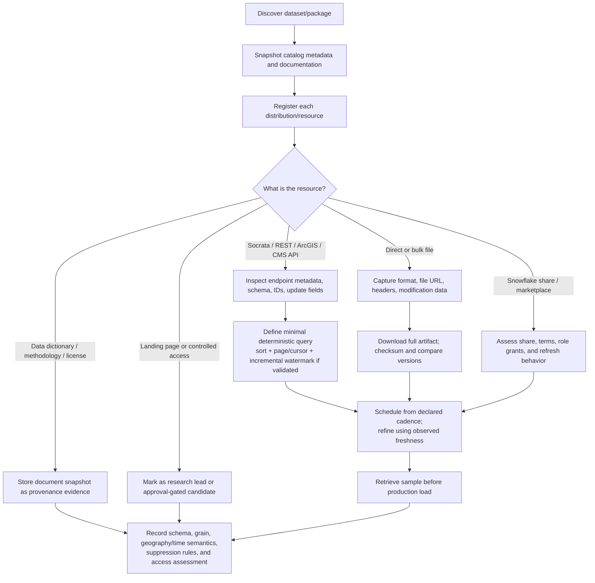
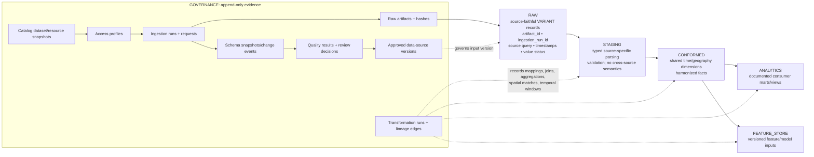
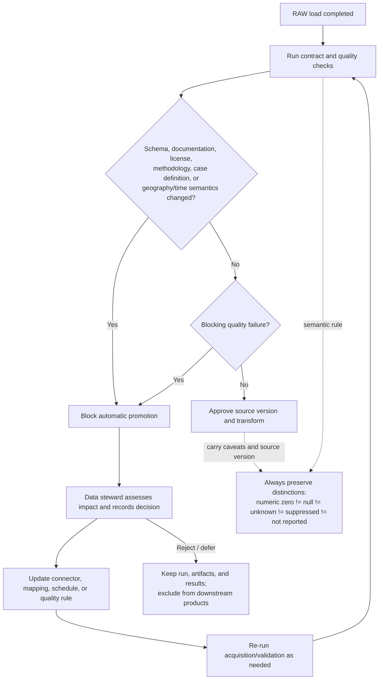

# Catalog-to-Snowflake Data Ingestion Diagrams

This document visualizes the project’s proposed path from open-data catalogs to governed Snowflake data products. It is a design guide derived from the project’s metadata-refresh plan and Snowflake provenance implementation contract; it is not a record of a deployed pipeline.

## 1. End-to-end architecture

```mermaid
flowchart LR
  subgraph Discovery[Discovery and registration]
    C["Catalogs<br/>Data.gov, HealthData.gov, Socrata/ODN, CMS"]
    M["Catalog metadata<br/>dataset, resource, cadence, license"]
    R["GOVERNANCE registry<br/>catalog_datasets<br/>catalog_resources<br/>source_access_profiles"]
    C --> M --> R
  end

  subgraph Acquisition[Source-specific acquisition]
    X{"Resource / access type"}
    API["API connector<br/>SODA, ArcGIS, CMS, REST"]
    FILE["File connector<br/>CSV, JSON, GeoJSON, ZIP, Parquet"]
    SHARE["Snowflake share / marketplace"]
    REVIEW["Documentation or controlled source<br/>register, assess, and obtain approval"]
    R --> X
    X --> API
    X --> FILE
    X --> SHARE
    X --> REVIEW
  end

  subgraph Landing[Immutable landing and RAW]
    RUN["Ingestion run and request ledger<br/>pages, retries, redacted query evidence"]
    ART["Immutable artifact + manifest<br/>unchanged payload, SHA-256, URI"]
    RAW["RAW schema<br/>dataset-specific table<br/>VARIANT payload + provenance columns"]
    API --> RUN
    FILE --> RUN
    SHARE --> RUN
    RUN --> ART --> RAW
  end

  subgraph Promotion[Validation, promotion, and use]
    CHECK["Schema and quality checks<br/>freshness, volume, duplicates, semantics"]
    GATE{"Material change or blocking failure?"}
    STEWARD["Data-steward review decision"]
    VERSION["Approved data-source version"]
    STAGE["STAGING<br/>typed source parsing"]
    CONF["CONFORMED<br/>harmonized facts and dimensions"]
    SERVE["ANALYTICS and FEATURE_STORE<br/>marts, features, model inputs"]
    RAW --> CHECK --> GATE
    GATE -- "Yes" --> STEWARD
    STEWARD -- "Approved" --> VERSION
    STEWARD -- "Not approved" --> HOLD["Retain evidence; do not promote"]
    GATE -- "No" --> VERSION
    VERSION --> STAGE --> CONF --> SERVE
  end
```



## 2. Catalog resource routing

Catalogs are discovery systems, not a single universal data API. Each catalog resource is classified and routed according to its actual delivery mechanism.



## 3. One ingestion run: reproducibility and evidence

```mermaid
sequenceDiagram
  autonumber
  participant S as Scheduler / Orchestrator
  participant G as GOVERNANCE registry
  participant C as Source connector
  participant P as Publisher API or file host
  participant A as Immutable artifact store / stage
  participant R as Snowflake RAW
  participant Q as Quality and review gate

  S->>G: Create ingestion_run (mode, code version, prior successful run)
  S->>C: Start source-specific extraction
  C->>P: Retrieve metadata, documentation, count, and sample
  C->>G: Log each ingestion_request (sequence, query, response metadata)
  C->>C: Compare schema/documentation with approved version
  loop Deterministic page, cursor, or file retrieval
    C->>P: Request data page/export
    P-->>C: Payload or retryable error
    C->>G: Log request, response count, headers, retry evidence
  end
  C->>A: Store unchanged payload(s) and manifest; calculate SHA-256
  A-->>G: Create raw_artifacts record(s)
  C->>R: Load source-faithful VARIANT payload with run and artifact IDs
  R-->>G: Record landed/loaded counts and RAW target
  S->>Q: Run schema, freshness, volume, duplicate, and semantic checks
  Q->>G: Persist data_quality_results and schema snapshot
  alt Passes and no material change
    Q->>G: Create/approve data_source_version
  else Blocking issue or material source change
    Q->>G: Set run to BLOCKED_REVIEW or FAILED/PARTIAL
    Q->>G: Record manual_review_decision; preserve all evidence
  end
```

## 4. Snowflake layer promotion and lineage



## 5. Promotion gate and safety boundaries



## Operating rules represented by the diagrams

- Use catalog metadata to set an initial polling schedule, but derive operational cadence and incremental strategy from observed source behavior.
- Capture metadata, documentation, sample/schema evidence, request history, raw artifacts, and hashes before data is promoted beyond `RAW`.
- Retain failed and partial attempts as evidence. Retrying or reloading must not erase the prior run.
- Do not promote material semantic or schema changes until a steward has recorded an approval decision.
- Carry source version, retrieval time, geography/time semantics, transformation run, and relevant caveats into conformed and consumer-facing data products.
- Keep credentials and protected values out of registry tables, logs, and `VARIANT` evidence payloads; log only redacted request details.

## Project sources

- [Snowflake Data Provenance Implementation](SNOWFLAKE_DATA_PROVENANCE_IMPLEMENTATION.md) — schemas, operational workflow, quality gates, lineage, and governance requirements.
- [requirements.md](requirements.md) — binding functional, operational, and testing requirements.
- [source-onboarding-spec-cdc-lyme-socrata.md](source-onboarding-spec-cdc-lyme-socrata.md) — catalog routing, approval gate, and reference-source requirements.
- [implementation-decisions.md](implementation-decisions.md) — binding technology and deployment decisions.
