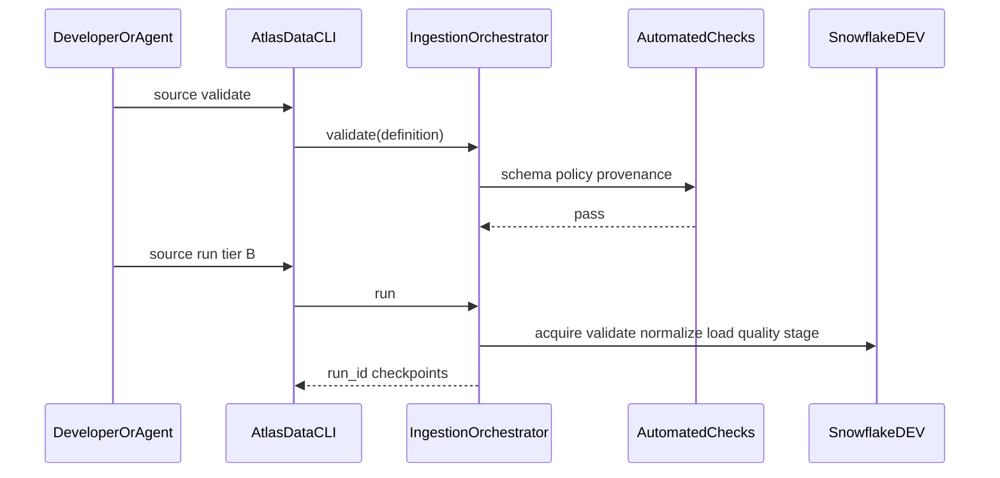
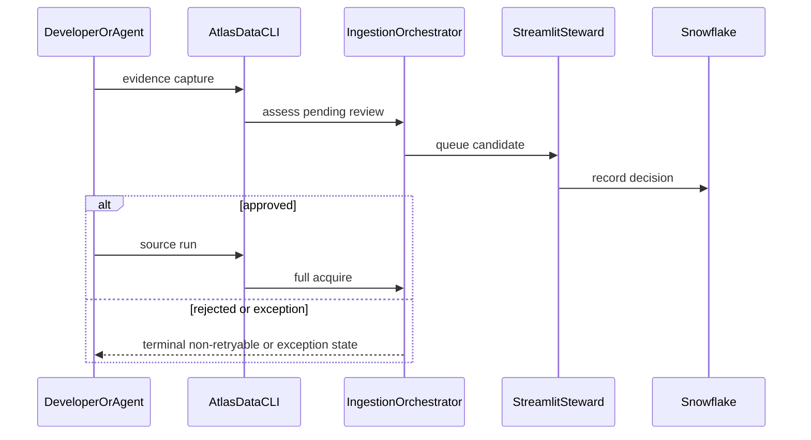

# Simplified Ingestion Operating Model

Parent: Epic #223 / Story #224 / [ADR 0027](../adr/0027-tiered-ingestion-operating-model.md)

This is operational guidance for implementers. It is intentionally short.

## Control matrix (golden-path CDC/Socrata `cdc_lyme_x5j9_wybp`)

| Control | Tier A | Tier B DEV | Tier C PROD | Tier D Exception |
|---|---|---|---|---|
| SourceDefinition schema validation | Required | Required | Required | Required |
| Fixture/mock acquisition | Allowed | N/A | Forbidden | As needed for evidence |
| Live public acquire | Forbidden | Allowed after auto-checks | Allowed after protected promote path | After steward approval |
| Streamlit steward click to advance technical stages | N/A | **Removed** | Not used as stage unlock | **Required** |
| Immutable artifact + checksum | Local fixture hash OK | Required | Required | Required |
| Snowflake RAW load | Forbidden | Allowed | Allowed | After approval |
| dbt / quality | Local planned mapping OK | Required | Required | Required |
| Digest promotion (ADR 0006) | N/A | N/A | Required | N/A |
| New source-specific Actions YAML | Forbidden | Forbidden | Forbidden | Documented exception only |
| New source-specific Snowflake role | Forbidden | Forbidden | Forbidden | Documented exception only |
| Source-specific recovery workflow | Forbidden | Forbidden | Forbidden | Documented exception only |

## Phase 2 source boundary

Routine public Socrata definitions (`cdc_lyme_x5j9_wybp` and the migrated
`cdc_lyme_qtbi_xd4i`) use the same bounded adapter and V068 checkpoint store in
DEV. Their generic V069 effects retain immutable source artifacts, normalized
lineage, idempotent row projections, quality results, and a staged publication
record; V070 persists the payload projections used for fresh-process resume.
`run-ingestion.yml` is the only routine Actions entry point.

The tick county-status workbook is a permanent Tier D restricted-egress
exception under [ADR 0023](../../adr/0023-dev-operator-captured-restricted-evidence.md).
Its evidence-only definition is fail-closed for Tier B/C. Revisit only when the
publisher offers a permitted runtime-accessible transport and the steward
reviews a replacement source definition, canonical mapping, and raw-byte
handling. The protected historical CDC workflows are likewise exception-only
for approved source-version capture, publication, recovery, and rollback.

## Removed from Tier A/B happy path

1. Human approval solely to move between technical stages
2. Per-source capture/ingest/recover Actions copies
3. Per-source orchestration-only Snowflake roles/procedures
4. Allowlist SQL rewrites as a routine onboarding step
5. Manual App Platform topology surgery for bounded DEV smoke

## Canonical commands

```text
atlas-data source init --adapter socrata --resource-key <key>
atlas-data source validate --definition config/sources/<file>.yml
atlas-data source run --definition ... --tier A|B [--dry-run]
atlas-data runs show --run-id <id>
atlas-data runs resume --run-id <id>
atlas-data runs explain --run-id <id>
```

## Diagrams

### Happy path (Tier B)



### Exception path (Tier D)


