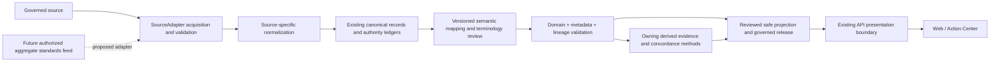

# Atlas interoperability architecture and adapter boundary v1

DATA #471; based on [DATA473 audit](provenance-readiness-v1.md).
This document composes existing versioned interfaces; it creates no adapter
implementation, alternate evidence model or claim of HL7 ingestion.

## Implemented interfaces

`SourceAdapter` in `ingestion/adapters.py` accepts a governed `SourceDefinition`.
It implements `acquire`, `validate_payload`, `normalize`, `restore_raw_payload`.
Acquisition retains response bytes/checksums and optional multi-artifact
packages. `NormalizeResult` carries records and a transformation version;
`StreamingSourceAdapter.normalize_iter` optionally supplies bounded records.
The existing orchestrator owns checkpoints, run/artifact identity, persistence,
quality and staged publication. Normalization is source-specific; returning
records does not make them approved semantic observations.

Current `AdapterKind` values are `rss_atom`, `socrata`, `http_xlsx`, `http_json`,
`http_csv`, `neon_release_package`, `nclimgrid_daily`, `annual_nlcd`, and
`modis_vegetation`. These cover discovery feeds, API/structured files,
workbooks, release packages and dedicated scientific-file processing. An enum
entry is code capability, not a claim that a source is live, authorized or in
PROD. `interface-freeze.md` remains the ingestion authority; SourceDefinition
does not contain transformation programs, role names or semantic measure definitions.

The source-independent scientific boundary is the existing
`semantic_source_mappings.map_record(record, metadata, authority, mappings, ...)`.
It consumes selected retained canonical/derived records, not arbitrary transport
payloads. The registry pins mapping ID, resource, version/vintage, source field,
measure, origin, grain and time. It builds a domain assertion and lineage trace
using #190/#191/#193 validation; it performs no ingestion, query or publication.
Actual authority rows must be supplied by the governed caller. Fixture mode
does not authorize a source. Exact environmental metadata approvals retain
their existing gates.

## Minimum semantic adapter output obligations

| Obligation | Existing authority |
| --- | --- |
| Stable source/product/version/vintage, publisher, retained record or hash, run and artifact ancestry | #191 provenance and #193 authority joins; each derived source anchor retained separately |
| Canonical measure ID/version and scientific meaning, unit/denominator, origin, allowed states | #190 definitions/signature and #191 matching metadata |
| Native geography, typed observation time and canonical strata | #190 scope; #192 mapping and normalization proofs |
| Value/state without null-to-zero coercion | #190; publisher statuses remain distinct from biological absence |
| Versioned method/transformation and exact derived input/result revisions | #193 and owning derived-result contracts |
| Quality, eligibility, representativeness, uncertainty, limitations and honest evidence basis | #191 references to owning quality contracts; no parallel score taxonomy |
| Safe consumer output with exact revisions | #194 schema/projection after validation; classification alone grants no publication |

Use the existing JSON mapping registry, #191 fixtures and #194 consumer schema
as machine-readable examples. [Audit inventory](provenance-readiness-v1.json)
pins their paths and representative IDs. The reproducible demo is the existing
fixture mapping/lineage/consumer tests, including rejected orphan/mismatched
authority references; it proves reuse of canonical contracts, not a standards
transport or source-backed clinical demonstration. Real replay reuses existing
#443/#496 ownership and requires reviewed #191 metadata and approved
consumer-safe lineage, beyond real authority rows. The
[ownership handoff](followup-authority-replay.md) and
[bounded human proposal](followup-human-shapes.md) remain pending parent
resolution. The human scope is existing fixed-release case-floor/SVI-denominator
two-input lineage and native STATE unallocated semantics, with no historical
denominator ingestion. DATA473 criterion 4 and DATA471 criterion 6 remain open
until bounded follow-up ownership is accepted; drafts alone do not satisfy
them. #470 and #472 remain separate.

## Standards positioning: future only

Reference baseline, consulted 2026-10-02: [FHIR R4 4.0.1 Observation](https://hl7.org/fhir/R4/observation.html)
and [Bulk Data Access STU2 2.0.0](https://hl7.org/fhir/uv/bulkdata/STU2/).
These are versioned design references, not an adopted profile or conformance claim.
FHIR Observation distinguishes clinically relevant `effective[x]` from the
availability time `issued`; neither is Atlas acquisition time. Its result and
absence-reason fields require reviewed conversion to Atlas value states.
Bulk export defines a data-access mechanism, not permission to access a feed
or a rule for producing county surveillance evidence.

A future authorized HL7 v2, FHIR or Bulk FHIR path must first validate its
selected standard/profile and terminology versions, then deduplicate and
aggregate within an approved privacy boundary outside current Atlas open-data
ingestion. Only the reviewed aggregate product can enter the existing adapter
boundary with its own dataset, method, denominator, time/grain, suppressed
states, representativeness and lineage. Laboratory positivity is not a case
count or population incidence; patient/event semantics cannot be relabeled as
county evidence. #472 must settle those scientific and governance choices.
#470 owns CDC Lyme/TBRD MMG/PHIN VADS mapping: no guessed code equivalences here.

Future patient-level processing requires exact authority, agreements, security,
privacy and aggregation review. Current Atlas requires no PHI, EHR connection,
TEFCA, Blue Button or standards-vendor transmission. No credentials, grants,
sources, scoring/review transport dependencies or deployment are introduced.

## Compatibility and review

An adapter addition must retain existing downstream meaning and public county
contracts. A new scientific meaning uses the existing reviewed measure/version
transition; metadata and assertion changes create immutable revisions; a new
publication uses a governed release. Adding a transport never silently changes
units, denominators, cohort, native grain or state meanings. Existing scoring
and review consume governed evidence rather than transport formats. Main must
be refreshed and affected tests plus exact-head CI passed before parent merge.
Runtime acceptance remains a separate requirement for any future implementation.
