# Future clinical laboratory signal contract v1

**Owner:** Atlas data stewardship and engineering. **Status:** future conceptual design, not source admission or production scoring. **Machine contract:** [clinical-lab-signal-v1.json](clinical-lab-signal-v1.json). DATA #472 under #469; composes the [adapter boundary](adapter-boundary-v1.md), [provenance audit](provenance-readiness-v1.md), #470 [human surveillance crosswalk](../semantic-domain/atlas-human-mmg-crosswalk-v1.md), and #188 semantic/lineage foundation. #559 owns existing incidence-floor and state-unallocated hardening, outside this design.

## Boundary and mapping

```mermaid
flowchart LR
  A[Authorized clinical source] --> B[FHIR, Bulk FHIR or equivalent acquisition]
  B --> C[Controlled patient-level processor]
  C --> D[Normalize, deduplicate, quality check]
  D --> E[County/week aggregation and privacy suppression]
  E --> F[Atlas SourceAdapter and governed authority]
  F --> G[Existing canonical semantics, metadata and lineage]
  G --> H[Candidate lab evidence]
  H --> I[Concordance and epidemiologist review]
```

Identifiable records stop in the authorized controlled processor. The Atlas downstream product receives only reviewed aggregate evidence. The future aggregate adapter must retain source product/version, publisher, acquisition and observation time, method, terminology mapping, denominator, value state, representativeness and limitations. `SourceAdapter` can acquire/normalize a governed aggregate product; #190/#191/#193 contracts validate its meaning, metadata and ancestry; #194 governs a safe projection. A transport format does not authorize ingestion or publication. No FHIR adapter, clinical source, clinical release, or live concordance workflow is implemented here.

USCDI v6 Laboratory Tests and Values/Results are the data-element anchor; they do not dictate a Lyme case algorithm. FHIR R4 `Observation.code` names the assay, `value[x]` the result, `interpretation` a categorical flag, `effective[x]` clinically relevant time, `issued` availability time, `subject` the patient context and `specimen` the specimen link. `DiagnosticReport.code`, `result`, `subject`, `specimen`, `effective[x]` and `issued` group/report observations; report and atomic observation are not extra independent tests. FHIR Provenance may identify an agent/activity/source, but required Atlas provenance also includes local acquisition, aggregation method and governed source ancestry. US Core v9 lab profiles are applicable only after source profile validation. Bulk Data STU2 is an optional authorized export method, not consent, authority or access. CMS interoperability does not automatically grant Atlas clinical-laboratory data access.

LOINC candidate mappings require the actual analyte, specimen, property, scale and method, plus source code/version and review. Lyme serology screens, confirmatory immunoblots, molecular assays, panels and quantitative outputs cannot be flattened into one exact LOINC equivalence. No production code mapping is approved by this document. A test order, performed test, assay identity, qualitative/quantitative value, interpretation flag, derived positivity, repeated tests and two-tier algorithm outcome are separate facts. A positive result is **never** a confirmed or probable surveillance case. The #470 MMG crosswalk concerns aggregate surveillance semantics; it does not classify clinical observations.

The processor must document whether county means residence, care location or laboratory location, and handle referrals and unknown location without invented county identity. It must choose effective-time week, retain issued and acquisition lag separately, reject invalid/corrected duplicate results under a versioned policy, and keep un-interpretable tests out of positivity denominators. Two-tier status may be unresolved even when a screen is positive. The fixture's `k=3` is only an illustrative suppression rule; actual minimum cells, complementary suppression, identity matching, geography, and denominator policy need governance review. A suppressed numerator and denominator remain null, never zero. Missing, unknown, not reported and unavailable are likewise distinct. Candidate rates are test-result proportions, not population incidence or local transmission estimates.

Every candidate in the JSON contract is county/ISO-week unless a later reviewed version changes it. Its numerator, denominator and unit are specified there; every record additionally needs source organization, dataset/version/vintage, acquisition time, observation period, method/version, terminology/version, geography attribution, value state, lineage digest, representativeness and limitations. Historical comparison/anomaly definitions and thresholds are deferred. Lag-aware freshness compares clinical effective time with acquisition time and must expose reporting lag. No candidate enters the current MVP or scoring without independent source admission, scientific review and release governance.

## Concordance examples (review prompts only)

| Pattern | Possible reading | Required caution |
| --- | --- | --- |
| A. High finalized surveillance burden + elevated lab positivity | Supporting concordance for review | Neither proves local transmission; laboratory referral geography may differ. |
| B. Low finalized burden + rising test volume | Emerging concern or ascertainment activity worth review | Does not prove underreporting; surveillance lag and care-seeking may explain it. |
| C. High test volume + stable/low positivity | Testing behavior may explain activity | Do not infer disease increase from test volume alone. |
| D. Elevated positivity + sparse vector evidence | Cross-domain discrepancy for epidemiologist review | Sparse sampling is not vector absence; no causal or reporting-failure claim. |
| E. Recent lab rise + delayed finalized cases | Compare observation and publication lags | Unfinalized case data do not establish absence of disease. |
| F. High positivity + out-of-county referral hub | Recheck residence attribution and denominator | Care-location counts are not resident county risk. |
| G. Apparent volume spike + repeat testing | Recalculate with person/episode policy | Test events are not unique people or cases. |

## Reproduction and deployment gate

Run `uv run python scripts/demo_clinical_lab_contract.py` to map fabricated FHIR-like observations into one county/week aggregate. Run `uv run pytest tests/test_clinical_lab_contract.py` for boundary, suppression and claim guards. The emitted shape is a conceptual input to existing adapter/semantic contracts, not a validated #194 consumer projection or source-backed proof.

Actual deployment requires legal/public-health authority, source authorization, agreements/DUA where applicable, privacy and security review, minimum-cell and complementary suppression, geography policy, identity/deduplication methodology, laboratory terminology validation, production source admission and monitoring. Organization-specific choices are deferred; they do not block acceptance of this design story. Replacing this design with a live feed would require a separate governed change, source review, clinical methodology, tests and release approval.

## Standards references (consulted 2026-10-04)

- [USCDI v6](https://www.healthit.gov/isp/sites/isp/files/2025-07/USCDI-Version-6-July-2025.pdf), Laboratory class.
- [FHIR R4 Observation](https://hl7.org/fhir/R4/observation.html), [DiagnosticReport](https://hl7.org/fhir/R4/diagnosticreport.html), [Specimen](https://hl7.org/fhir/R4/specimen.html), [Provenance](https://hl7.org/fhir/R4/provenance.html).
- [US Core v9](https://hl7.org/fhir/us/core/STU9/) and [Bulk Data Access STU2](https://hl7.org/fhir/uv/bulkdata/STU2/).
- [LOINC](https://loinc.org/) terminology; source-specific mappings require validation.
