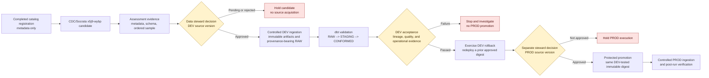

# Governed ingestion: next steps

This diagram documents the source-onboarding path after metadata registration.
It is not an authorization to ingest, approve a source, run dbt, or promote to
production. The Alpha POC database remains outside this process.

## What each step proves

1. **Steward review** establishes that the source has an acceptable use,
   provenance, license, geography, time semantics, and source-specific
   limitations. The pipeline supplies evidence; it cannot make this decision.
2. **Controlled DEV ingestion** obtains only the approved source version, keeps
   immutable artifacts and manifests, and loads source-faithful records to the
   isolated DEV `RAW` schema.
3. **Provenance and dbt validation** verifies the artifact-to-RAW lineage,
   row/load evidence, source-specific quality rules, and dbt results through
   `STAGING` and `CONFORMED`. A green deployment or a populated table alone is
   insufficient.
4. **DEV rollback exercise** proves the operational recovery path: the DEV job
   can be returned to a previously approved immutable image without rewriting
   retained artifacts or governance history.
5. **Separate PROD source approval** records an independent, environment-bound
   decision. A DEV approval must never be reused to activate a PROD source.
6. **Protected digest promotion** requires the production workflow and its
   designated approval to deploy the exact image digest already verified in
   DEV. It does not rebuild an image or make manual production changes.
7. **Controlled PROD ingestion and verification** runs the approved source on
   the production schedule and confirms the operational ledger, provenance,
   load, transformation, and rollback evidence.
